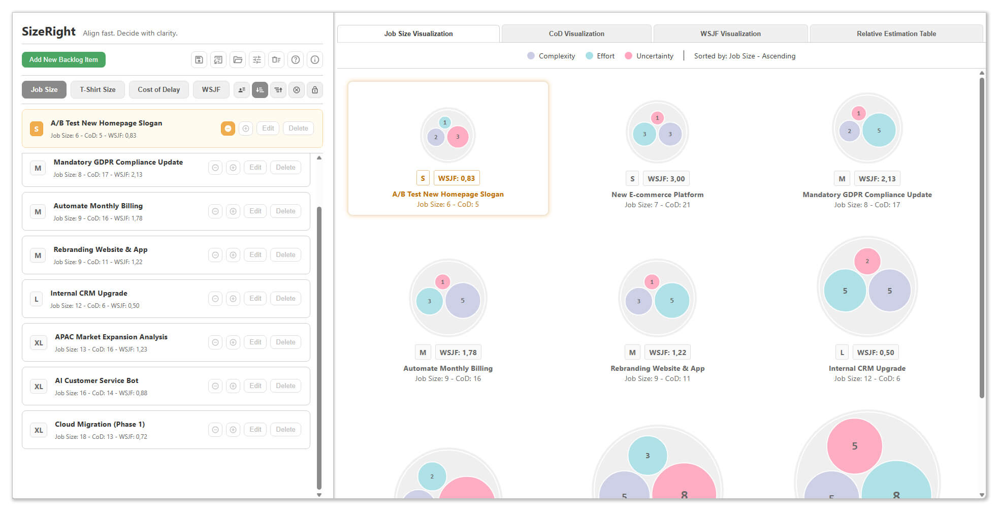
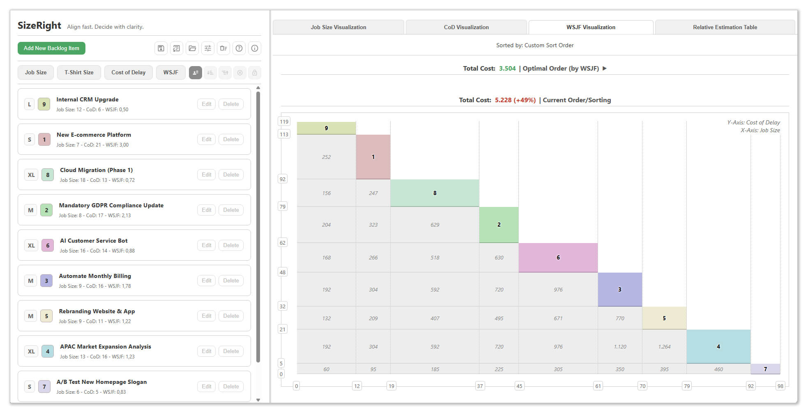
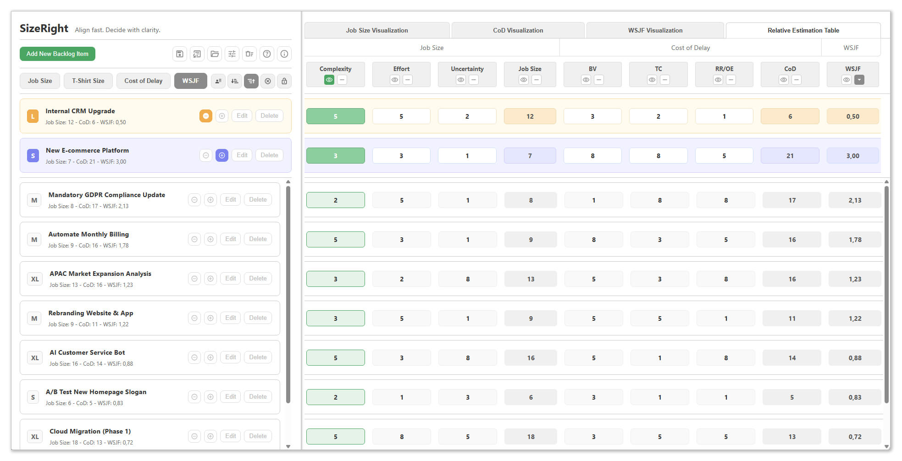
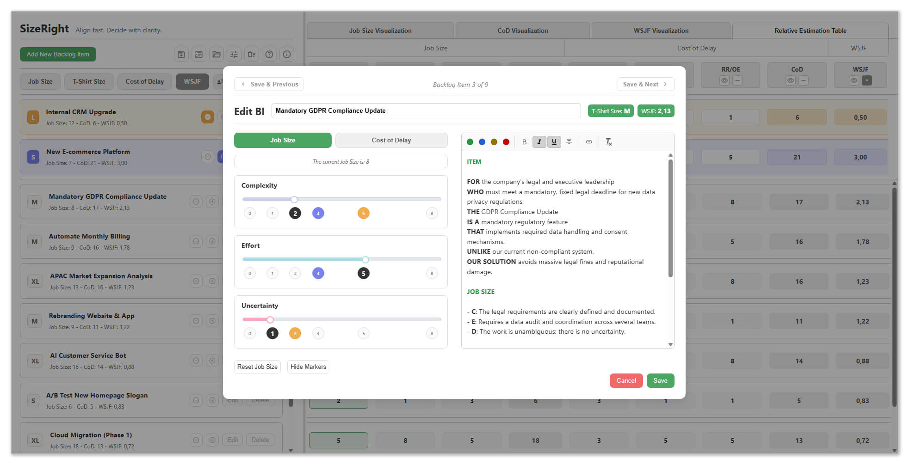

# SizeRight: Align fast. Decide with clarity.

**A dedicated visualization tool for Agile relative estimation and WSJF prioritization.**






## Overview

**SizeRight** is an open-source facilitation tool designed for Product Owners, Product Managers, and Epic Owners. It solves the challenge of lengthy, subjective estimation meetings by replacing "gut feelings" with a structured, data-driven process.

It acts as a **tactical pre-processor**—a "visual radiator" for your planning sessions to bridge the gap between vague ideas and concrete economic prioritization using **Weighted Shortest Job First (WSJF)**.

> **Note:** SizeRight is a client-side, single-file application. No server, no database, no installation required.

## Key Features

### Visual & Interactive Estimation

* **Relative Estimation Table:** Built for speed. This dedicated grid view allows you to **set and adjust values directly** (click-to-edit) while comparing items side-by-side. It enables a fast and uncomplicated relative estimation flow without the need to open detailed dialogs for every change.
* **Bubble Chart Visualization:** Instantly spot outliers by visualizing **Complexity**, **Effort**, and **Uncertainty** as distinct dimensions rather than a single number.
* **Interactive WSJF Charts:** Visualize the economic impact of your decisions. The **WSJF Visualization** tab compares your "Current Order" against the mathematically "Optimal Order," showing exactly how much **Cost of Delay** you accumulate by delaying high-value items.

### Customizable & Flexible

* **Full Customization:** Adapt the tool to your team's style. Switch estimation scales between **SAFe Fibonacci** (1, 2, 3, 5, 8) or **Arithmetic** (1-8), customize **T-Shirt size** buckets, and adjust **Color Schemes** for charts and highlighting.
* **Triangulation:** Set "Reference Items" (Min/Max) to act as anchors for your relative scales.

### Data & Integration

* **CSV Export:** Seamlessly move your data. Export your prioritized backlog to **CSV** for further analysis in Excel or to import it into enterprise tools like **Jira** or **Azure DevOps**.
* **Privacy First:** 100% Client-side. Your data never leaves your browser. Save your session state via JSON export/import.

## The Process: From "Vague" to "Verified"

SizeRight guides your team through two sequential steps:

1. **Align Fast (Job Size):** We estimate **Job Size** not by hours, but by comparing relative factors. The "Bubble Chart" immediately reveals *why* an item is large (e.g., high uncertainty vs. high effort).
2. **Decide with Clarity (WSJF):** We calculate the **Cost of Delay** (User Value + Time Criticality + Risk Reduction). The tool automates the **WSJF** calculation to identify "Quick Wins"—items that deliver the highest value for the least effort.

## Installation & Usage

### Prerequisites

* A modern web browser (Chrome, Firefox, Edge, Safari).
* A screen resolution of **1920x1080 or higher**. (The tool is explicitly **not responsive**; it is designed as a "Visual Radiator" for large meeting room monitors or projectors to preserve data comparability).

### How to Run

Since SizeRight is a single-file application:

1. Download the `SizeRight.html` file (or the latest release).
2. Open it in your browser.
3. Start estimating!

## Data Privacy

SizeRight operates entirely within your browser's local sandbox.

* **No Server:** No data is transmitted to the cloud.
* **Persistence:** Data is stored in `localStorage` to survive page refreshes.
* **Control:** You own your data via JSON/CSV export.

This architecture makes it safe for use in high-security environments.

---

## Installation & Development

### Prerequisites
Ensure you have **Node.js** and **npm** installed on your machine to manage dependencies and run the build script.

### Installation
Clone the repository and install the required dependencies (such as `terser`, `js-beautify`, and `marked`) needed for the build process:

```bash
npm install

```

---

## Build Process

The project includes a custom Node.js build script (`build.js`) that tests, compiles, minifies, and packages the application into a single HTML file.

To start the build, run:

```bash
node build.js

```

### What the Build Script Does

The `build.js` script automates the following workflow:

1. **Integrity Check:** Runs unit tests (`npm test`). If tests fail (files `01_*.test.js` through `06_*.test.js`), the build aborts immediately to ensure quality.
2. **Asset Loading:** Reads source files, including the HTML template, `config.json`, `language.json`, and CSS.
3. **Documentation Processing:** Converts Markdown documentation (`documentation_*.md`) into HTML using `marked` and injects it into the templates.
4. **Optimization:**
* **CSS:** Cleans and formats the `style.css` (removes comments/whitespace).
* **JavaScript:** Minifies the application code (`1_main.js` to `6_utils.js`) using `terser` and bundles it with `Sortable.min.js`.

5. **Output Generation:** Injects all assets into `template.html` and produces a versioned file named `SizeRight_Build_(v.X.X.X).html`.

---

## Project Structure

| File / Directory | Description |
| --- | --- |
| **Source Code** |  |
| `1_main.js` - `6_utils.js` | Modular JavaScript source files for the application logic. |
| `style.css` | The main stylesheet. |
| `template.html` | The base HTML skeleton used for the build output. |
| `Sortable.min.js` | Dependency for drag-and-drop functionality. |
| **Tests** |  |
| `01_*.test.js` - `06_*.test.js` | Unit tests corresponding to the source modules. |
| **Configuration** |  |
| `config.json` | Global configuration settings. |
| `language.json` | Localization strings for the UI. |
| `documentation_*.md` | Source documentation files (Markdown) included in the build. |
| **Build Tools** |  |
| `build.js` | The main script for testing, compiling, and building the project. |

---

## License

**MIT License**

Copyright © 2025 Jakob Michael SPERKER

Permission is hereby granted, free of charge, to any person obtaining a copy of this software and associated documentation files (the “Software”), to deal in the Software without restriction, including without limitation the rights to use, copy, modify, merge, publish, distribute, sublicense, and/or sell copies of the Software, and to permit persons to whom the Software is furnished to do so, subject to the following conditions:

The above copyright notice and this permission notice shall be included in all copies or substantial portions of the Software.

THE SOFTWARE IS PROVIDED “AS IS”, WITHOUT WARRANTY OF ANY KIND, EXPRESS OR IMPLIED, INCLUDING BUT NOT LIMITED TO THE WARRANTIES OF MERCHANTABILITY, FITNESS FOR A PARTICULAR PURPOSE AND NONINFRINGEMENT. IN NO EVENT SHALL THE AUTHORS OR COPYRIGHT HOLDERS BE LIABLE FOR ANY CLAIM, DAMAGES OR OTHER LIABILITY, WHETHER IN AN ACTION OF CONTRACT, TORT OR OTHERWISE, ARISING FROM, OUT OF OR IN CONNECTION WITH THE SOFTWARE OR THE USE OR OTHER DEALINGS IN THE SOFTWARE.

```

### Nächster Schritt
Möchtest du, dass ich dir passend dazu noch eine `.gitignore` Datei erstelle, damit `node_modules` und die generierten Build-Dateien nicht versehentlich ins Repository hochgeladen werden?

```